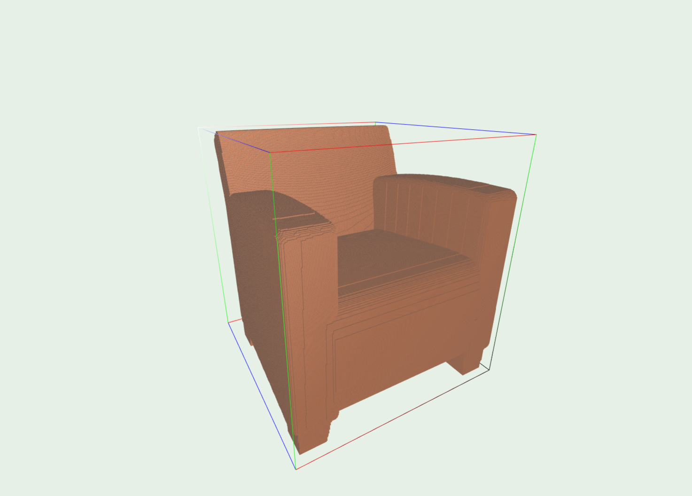
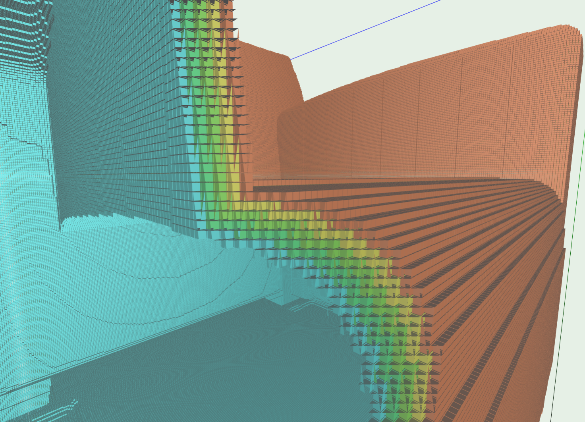
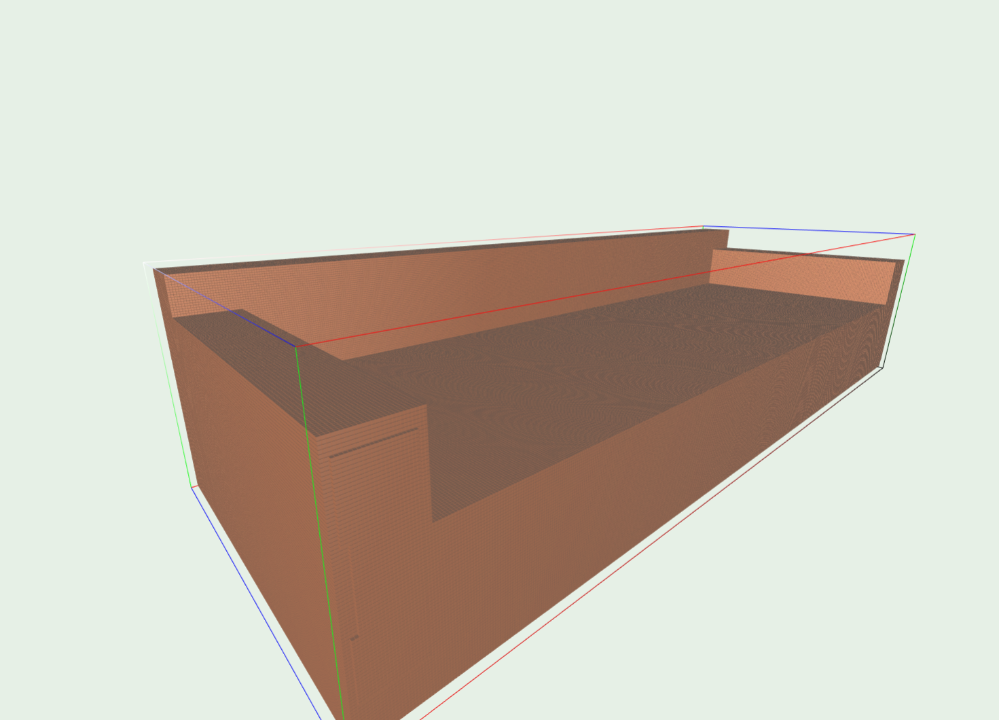
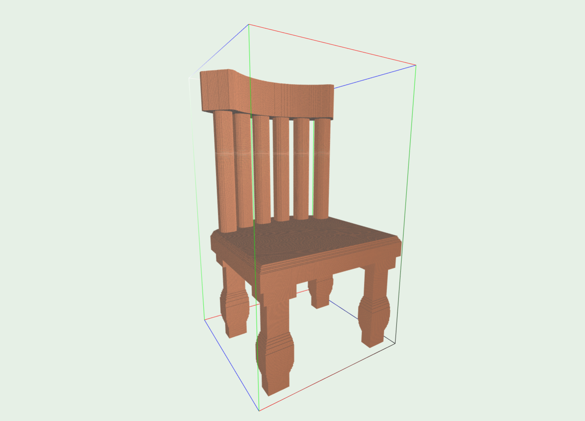
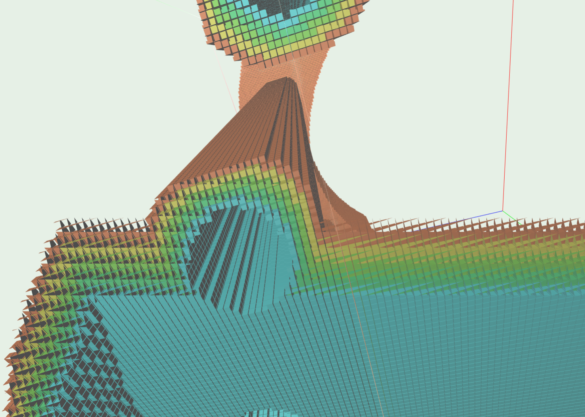
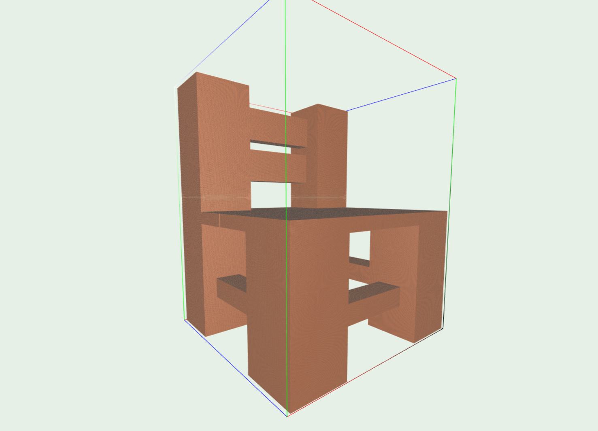
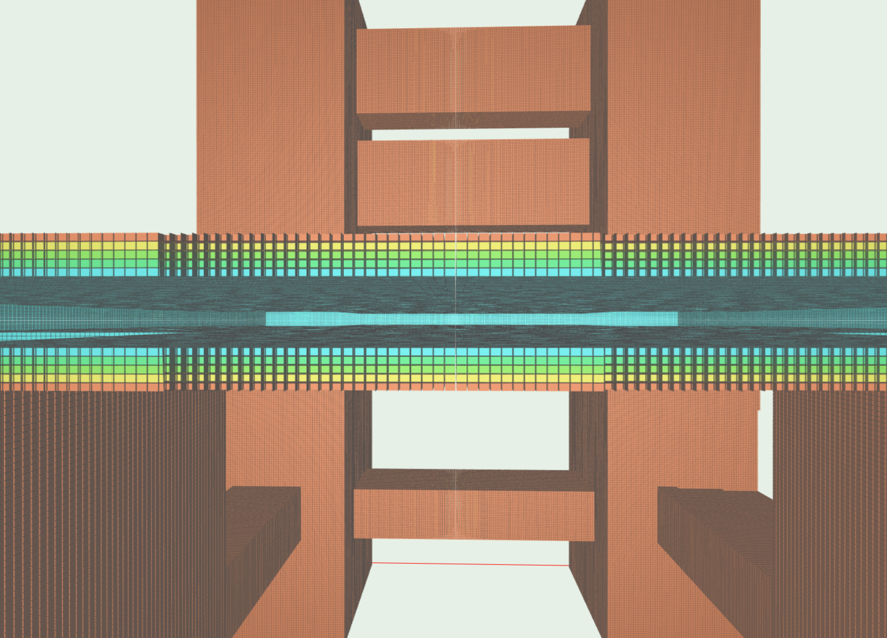

# generate-watertight-meshes-and-sdf-grids
Generate watertight meshes and sdf grids from degenerate, non-manifold meshes

## Example pics


| SDF grid           | Inside View (blue = inside, red = outside |
:-------------------------:|:-------------------------:|
  |   
  |   
  |   
  |   


## Advantages

- Always finds inside/outside (see examples), even though the original mesh may contain **intersecting triangles, no normals, tiny holes**
- Very fast though CUDA implementation
- Output from Marching Cubes is garantueed to be watertight
- High resolution (grid dimension > 1000) possible

## Dependencies

- CUDA
- glm
- Eigen3

## How-To Install

```
git submodule update --init --recursive
mkdir build
cd build
cmake ..
make -j 4
```

## How-To Run

See example script
```
bash example.sh
```

or 

```
Generating watertight sdf grids via watershed.
Usage:
  watershed [OPTION...]

  -i, --in arg     input mesh file
  -o, --out arg    output file
  -r, --res arg    resolution (default: 0.002)
  -t, --trunc arg  surface truncation distance in voxels (default: 5)
  -p, --pad arg    outer padding for voxelgrid (default: 5)
  -v, --verbose    verbose
  -h, --help       Print usage

```

## How does it work?

It is based on a 3D watershed/floodfill algorithm, where from each corner of the grid you <i> fill water </i> in the grid until you reach a stationary state where
the water cannot penetrate anymore the inside of the object as it is being held out by its surface. Here is an illustration:


